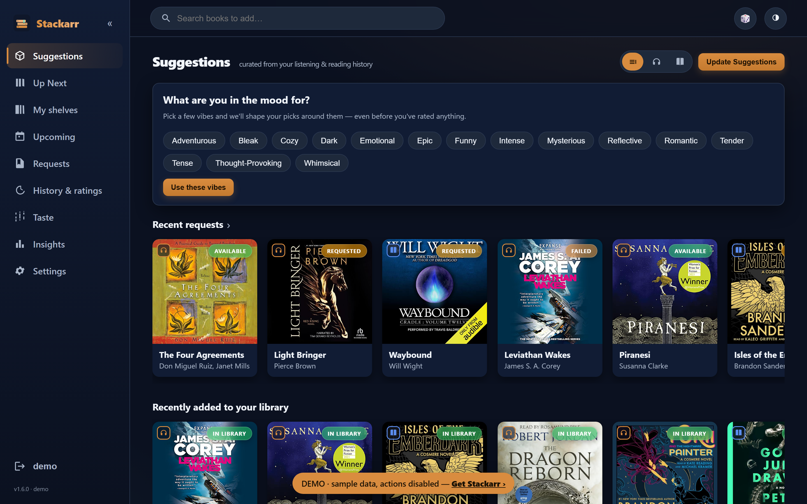
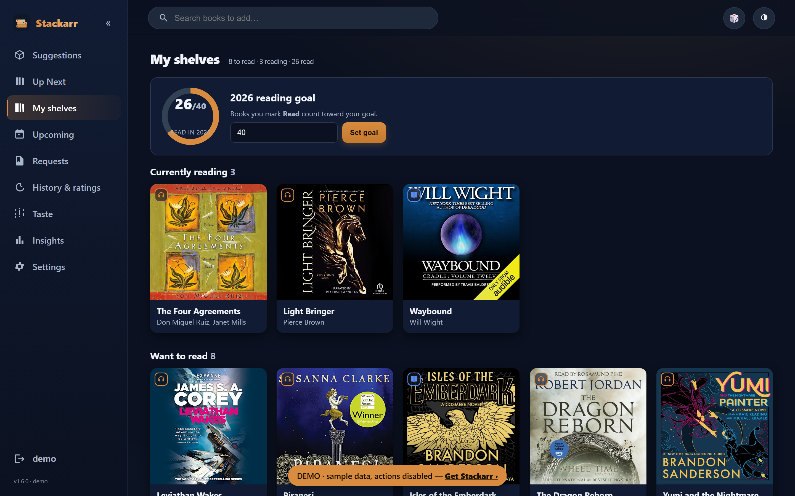
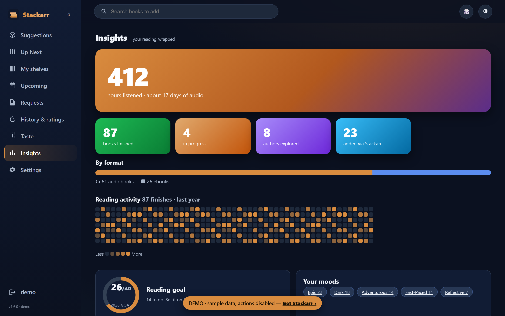
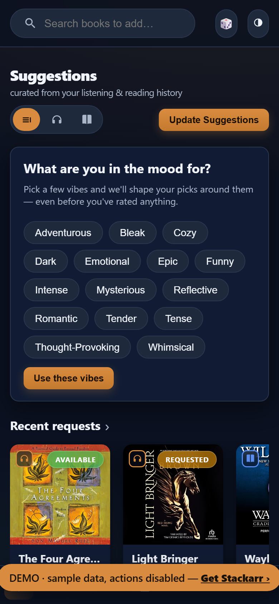

# Stackarr

#### You've got a thousand books on your own server. So why is "what next?" still so hard?

Your homelab already nails the boring parts. Sonarr finds your shows, Radarr your
movies, and Chaptarr grabs your books. But nothing ever answers the actual
question you have at 11pm with headphones in: *out of everything I could read or
listen to next — what's actually worth it?*

That's the whole job of **Stackarr**. It quietly learns your taste from the
library you already have, lines up a shelf of "you'll probably love this — and
here's why," and when you say yes, hands it straight to Chaptarr to download.
It's a private, self-hosted **Goodreads / StoryGraph alternative** wired into
**Audiobookshelf, Kavita and Calibre-Web** — for **audiobooks *and* ebooks**.

No AI. No cloud. No account. Nothing phones home, and every single pick comes
with a plain-English reason you can argue with.

<p align="center">
  <a href="https://katalyst88.github.io/stackarr/"></a>
</p>

<p align="center">
  <a href="https://katalyst88.github.io/stackarr/"><b>▶ Try the live demo</b></a> — no install, runs in your browser ·
  <a href="RECOMMENDATIONS.md">how the picks are made</a>
</p>

<p align="center">
  
  
  
  
</p>

### What it actually does

- **Recommends from *your* taste, not a bestseller list.** It reads what you've
  finished, what you've rated, and the *moods* you gravitate to — fast-paced,
  dark, cozy, epic — StoryGraph-style, but private. Then it explains every pick.
- **Audiobooks and ebooks, one shelf.** Pulls your library from Audiobookshelf,
  Kavita, Calibre-Web (and Komga / OPDS). Run one format or both.
- **One tap and it's downloading.** Approve a suggestion and Chaptarr does the
  searching, grabbing and importing. Stackarr never touches a download client.
- **It's a reading tracker too.** Want / Reading / Read shelves, a yearly reading
  goal, a GitHub-style activity heatmap, "up next" for your series, and
  Wrapped-style insights into your year.
- **Built to be lived in.** Browse by mood, follow authors for new-release pings,
  hit "surprise me" for one perfect pick, leave reviews, chase hidden gems. A
  clean, installable PWA that's genuinely nice on a phone.

> Built by someone who uses it every single day. Written largely with an AI
> assistant (the *app* has none) — so skim the code before you trust it with your
> stack. Issues and PRs very welcome.

<p align="center">
  
  
  
</p>

---

## Features

- **Audiobooks _and_ eBooks** *(new in 1.5)* — a format toggle (Settings → General):
  **Audiobooks** (Audiobookshelf), **eBooks** (Kavita / Calibre-Web), or **Both**.
  Single-format installs stay clean — the other format's UI never appears; in
  *Both* mode every card gets a format badge and a per-format filter. Approved
  ebook picks hand off to Chaptarr in the ebook media type. Default is audiobook,
  so existing installs are unchanged until you flip it.
- **13 recommendation rows**, all deterministic & explainable: Series to finish ·
  More from authors you love · Readers also enjoyed · New authors to discover ·
  Narrators you love · More in your favourite genres · Hidden gems · Award winners ·
  Short listens · Epic listens · New & upcoming · From your reading list · Popular.
- **Browse cards** for genres and *suggested* authors → full grid, with **"add all
  books by this author"**.
- **Book detail pages** (cover, series, narrator, rating, full description, genres).
- **Multi-user** — everyone signs in with their own Audiobookshelf account and gets
  suggestions from *their* history; admins can auto-approve.
- **Approve / Ignore / Already-read** with learning (passes, DNFs, deletions, and
  optional 1–5★ ratings feed back in). "I've already read this" seeding too.
- **Up Next** — a series tracker: every series you're collecting, how far you are,
  and the next book with its state (in library / requested / ready to add).
- **Taste** — see and undo everything that shapes your picks (ratings, did-not-finish,
  passed, already-read seeds, removed books) in one place.
- **Quick-rate onboarding** — when your ratings are thin, a home-page card lets you
  rate books you've already heard to sharpen picks fast.
- **Discover** gallery (endless scroll) + search-to-add typeahead.
- **Insights** (Spotify-wrapped style): hours listened, top authors, fun facts.
- **History & ratings** — a scannable list of every book you've finished, rated, or
  marked read (cover · title/author · a prominent 1–5★ control that sharpens future
  picks). Unrated float to the top; rated sink to the bottom. Remove any book from
  history (it stops seeding suggestions too), or hide rated books automatically.
- **Auto-add to Chaptarr** *(optional, off by default)* — tiered auto-approval
  (Conservative / Moderate / Aggressive) hands high-confidence picks to Chaptarr
  with no manual tap; capped per cycle, skips owned books.
- **Shared ratings & reviews** *(new in 1.5)* — ratings are community-wide: every
  book page shows the average ★ and everyone's written reviews, and the home page
  carries a **Recently rated by readers** row.
- **Notifications** — alerts when a requested book lands in your library, a
  **new-release radar** *(new in 1.5)* that pings you when an author you read
  publishes, plus suggestion digests. Email (3 themes + live preview), Discord,
  Apprise (100+ channels), or a custom webhook. All **off by default**.
- In-app **Settings** for service connections (Audiobookshelf, **Kavita**,
  **Calibre-Web**, Chaptarr), SMTP, reading-list import (Goodreads/Hardcover),
  and a logs viewer — with Test buttons.
- Installable **PWA** or **[Android APK](https://github.com/katalyst88/stackarr/releases/latest)**,
  light/dark themes, responsive, embeds in **nzb360**.

## How recommendations work (no AI)

> Full algorithm write-up: **[RECOMMENDATIONS.md](RECOMMENDATIONS.md)** — inputs,
> lanes, scoring, mood matching, serendipity and the adventurousness dial.


Your Audiobookshelf history (finished + in-progress) is the seed. For each seed
Stackarr checks series order, author backlist, Audible's own "listeners also
enjoyed" (`/sims`), narrators, and genres via the public **Audible** catalogue and
**Audnexus** — no API key, no model. Candidates are scored by a transparent
weighted formula (recency, your ratings, rating floor, popularity dampening),
de-duplicated by edition, diversity-capped per author, and shown with their reason.

## Quick start

```bash
# Option A — published image (recommended)
mkdir stackarr && cd stackarr
curl -O https://raw.githubusercontent.com/katalyst88/stackarr/main/.env.example
mv .env.example .env          # fill in Audiobookshelf + Chaptarr details
docker run -d --name stackarr -p 8484:8484 --env-file .env \
  -v ./config:/config ghcr.io/katalyst88/stackarr:latest

# Option B — build from source
git clone https://github.com/katalyst88/stackarr && cd stackarr
cp .env.example .env
docker compose up -d
```

Open `http://your-host:8484` and sign in with your Audiobookshelf account.
Images are published to **GitHub Container Registry** (`ghcr.io/katalyst88/stackarr`)
automatically on every release.

### Requirements

- **Audiobookshelf** with an admin API token (also the login provider).
- **Chaptarr** with an API key, a root folder, and a download client configured
  *in Chaptarr*.
- (Optional, for eBooks) **Kavita** (API key — reliable reading progress) and/or
  **Calibre-Web** (OPDS user/password). Ebook metadata comes from Google Books +
  Open Library, no key required.
- (Optional) SMTP / Discord / Apprise; Goodreads or Hardcover for "Want to Read".

### Key configuration

| Variable | Purpose |
|---|---|
| `ABS_URL`, `ABS_ADMIN_TOKEN` | Audiobookshelf connection (also editable in Settings) |
| `CHAPTARR_URL`, `CHAPTARR_API_KEY`, `CHAPTARR_ROOT_FOLDER` | where approved picks go |
| `STACKARR_FORMATS` | `audiobook` (default) · `ebook` · `both` (also in Settings → General) |
| `KAVITA_URL`, `KAVITA_API_KEY` | eBook library + reading progress (or set in Settings) |
| `CALIBREWEB_URL`, `CALIBREWEB_USER`, `CALIBREWEB_PASS` | eBook library via OPDS (or in Settings) |
| `STACKARR_ADMINS` | ABS usernames who can auto-approve / see all queues |
| `STACKARR_HTTPS=true` | set when behind HTTPS → Secure cookies |
| `STACKARR_FRAME_ANCESTORS` | who may embed Stackarr (default own-origin) |
| `STACKARR_ACCENT`, `STACKARR_URL_BASE`, `AUDIBLE_DOMAIN` | theming / subpath / region |

See [`.env.example`](.env.example) for the full annotated list.

## Android app

Prefer an app icon to the PWA? Grab `stackarr.apk` from the
**[latest release](https://github.com/katalyst88/stackarr/releases/latest)**
and sideload it. It's a thin, configurable WebView client — on first launch it
asks for your Stackarr URL (e.g. `http://192.168.1.10:8484`) and remembers it;
use the menu to change servers or reload. Built from `android/` by CI
(`.github/workflows/android.yml`).

## Security

Auth is delegated to Audiobookshelf; all routes require login; brute-force login
throttling, CSRF same-origin protection, `HttpOnly`/`SameSite` cookies (`Secure`
over HTTPS), and configurable frame-ancestors. See [SECURITY.md](SECURITY.md).

## License

MIT — see [LICENSE](LICENSE).
